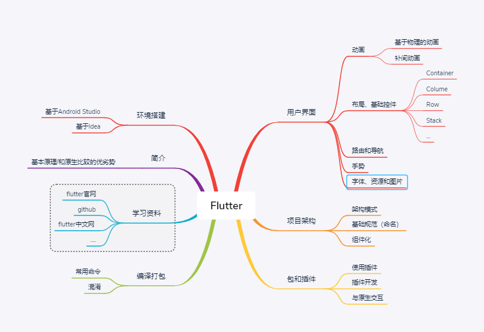

# Flutter 学习、总结
经过一个多月的Flutter项目开发和上线,现在总结一下Flutter的学习流程。仅供自己学习，如有什么问题，欢迎指出！Flutter学习资料([Flutter中文网](https://flutterchina.club),[Flutter官网](https://flutterchina.club))

## 思维导图

## flutter 架构
- [TodoMVC for Flutter ](https://github.com/brianegan/flutter_architecture_samples)

## 知识点(概括)
- 1、项目架构(mvc)。个人感觉flutter项目，如果没有好的一个架构，可读性很差，代码越多，越难看。
- 2、flutter多语言实践(Android studio Flutter i18n插件)
- 3、插件使用，通过[pub](https://pub.dartlang.org/packages/) 搜索需要的插件
- 4、Flutter 布局控件
- 5、Flutter 动画
- 6、网络请求
- 7、与原生交互通信(methodCall)
- 8、内部通信(notification)

## 开源库

1、[awesome-flutter](https://github.com/Solido/awesome-flutter) [12106⭐] 开源库集合，总结全面

2、[flutter-study](https://github.com/yang7229693/flutter-study) [1066⭐]一个flutter学习记录

## 其他总结

- [Flutter的原理及美团的实践](https://mp.weixin.qq.com/s/cJjKZCqc8UuzvEtxK1BJCw)
- [闲鱼Flutter混合工程持续集成的最佳实践](https://yq.aliyun.com/articles/618599)
- [饿了么物流技术团队 与Flutter第一次亲密接触-Android 视角](https://juejin.im/post/5b8d46c3e51d4538e710bc78)
- [微店的Flutter混合开发组件化与工程化架构](https://juejin.im/post/5c346ad8e51d4551ea7f0fdf)

持续添加...

